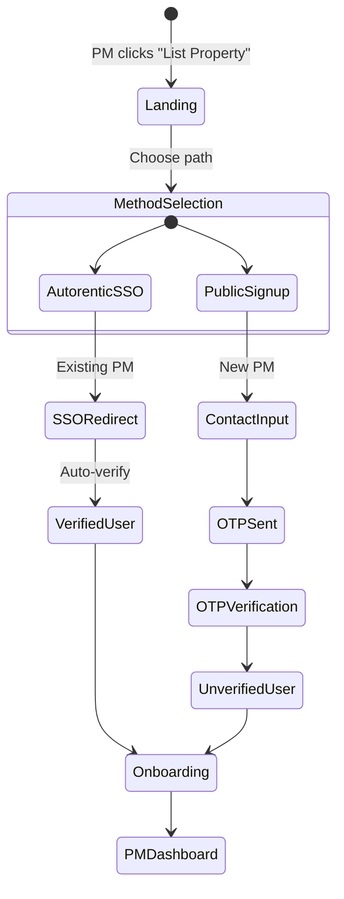
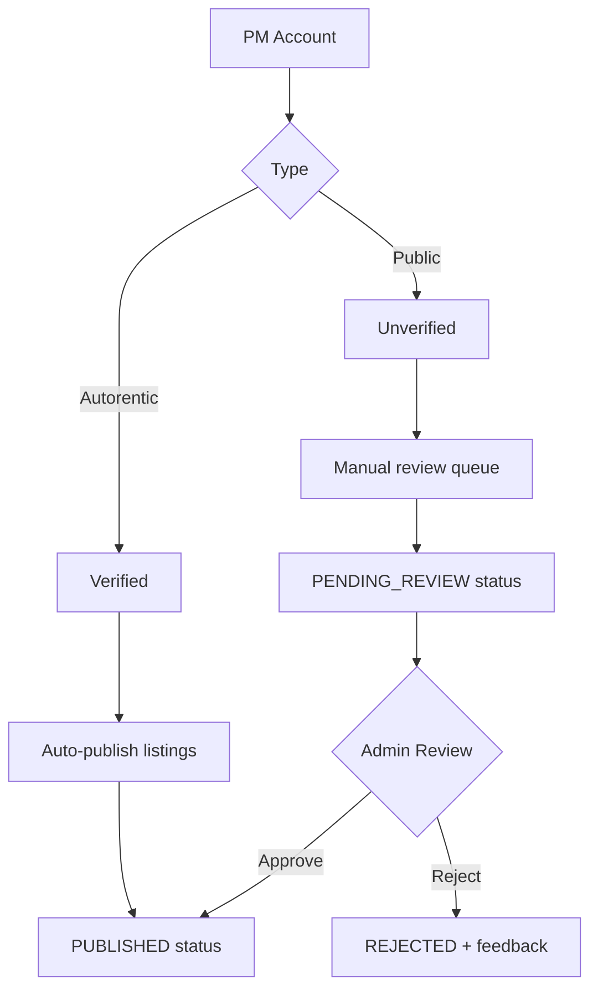

# Authentication System

## Overview
Dual-path authentication for Property Managers: Autorentic SSO (verified) + Email/Phone OTP (public).

## Files
- `components/PMAuth.tsx` - Multi-step auth UI (landing → method → OTP → verify)
- `components/OTPInput.tsx` - 6-digit OTP input component
- `components/PMOnboarding.tsx` - 2-step onboarding wizard

## Authentication Flow


## PMAuth.tsx State Machine
**4 Steps:**
```typescript
type AuthStep = 'landing' | 'autorentic' | 'public' | 'otp';

// Step transitions
landing → autorentic  // Click "Existing Autorentic User"
landing → public      // Click "New Property Manager"
autorentic → otp      // Enter email (simulate SSO)
public → otp          // Enter email/phone
otp → PMDashboard     // Verify OTP code
```

**State Variables:**
```typescript
const [step, setStep] = useState<AuthStep>('landing');
const [authMethod, setAuthMethod] = useState<'autorentic' | 'public' | null>(null);
const [contact, setContact] = useState('');  // Email or phone
const [isLoading, setIsLoading] = useState(false);
```

## Account Types


**Type Definitions:**
```typescript
type AccountType = 'autorentic' | 'public';

interface PMUser {
  id: string;
  name: string;
  email: string;
  phone: string;
  accountType: AccountType;
  isVerified: boolean;  // true for autorentic, false for public
  joinedDate: string;
}
```

## OTP Verification
**OTPInput.tsx:**
- 6-digit input with auto-focus
- Paste support (auto-splits "123456" into 6 boxes)
- Backspace navigation
- Submit on 6th digit

**Validation:**
```typescript
// Simulated verification (MVP)
const handleVerifyOTP = async (code: string) => {
  if (code.length !== 6) return;

  // Simulate API call
  await new Promise(resolve => setTimeout(resolve, 1500));

  // Mock success for demo (real: POST /api/auth/verify-otp)
  const user: PMUser = {
    id: generateId(),
    email: contact,
    accountType: authMethod,
    isVerified: authMethod === 'autorentic',
    ...
  };

  onAuthSuccess(user);
};
```

**Real Implementation:**
```typescript
// Backend endpoint
POST /api/auth/send-otp
Body: { contact: string, method: 'email' | 'sms' }
Response: { success: boolean, expiresIn: 300 }

POST /api/auth/verify-otp
Body: { contact: string, code: string }
Response: { token: string, user: PMUser }
```

## Autorentic SSO (Simulated)
**Flow:**
1. User clicks "Existing Autorentic User"
2. Enters email
3. Simulate redirect to `auth.autorentic.com/oauth`
4. Simulate callback with auth token
5. Exchange token for PMUser object
6. Auto-set `isVerified: true`

**Real Implementation:**
```typescript
// OAuth 2.0 flow
window.location.href = `https://auth.autorentic.com/oauth/authorize?
  client_id=${CLIENT_ID}&
  redirect_uri=${REDIRECT_URI}&
  response_type=code&
  scope=profile,email,pm_access`;

// Callback handler
const code = new URLSearchParams(location.search).get('code');
const response = await fetch('/api/auth/autorentic/callback', {
  method: 'POST',
  body: JSON.stringify({ code })
});
const { token, user } = await response.json();
```

## Onboarding Flow
**PMOnboarding.tsx - 2 Steps:**

**Step 1: Benefits**
- Zero listing fees
- Verified tenant pool
- Quick setup (5 min)
- Integration with Autorentic (if applicable)

**Step 2: Terms & Conditions**
- Accurate listing information
- Responsive to inquiries (24hr target)
- No ghost listings
- Compliance with local laws
- Checkbox: "I agree to terms"

**Skip Logic:**
```typescript
// Show onboarding only for new users
const isNewUser = !localStorage.getItem(`pm_onboarded_${user.id}`);
if (isNewUser) {
  setShowOnboarding(true);
} else {
  setShowOnboarding(false);
  // Direct to dashboard
}
```

## Trust & Verification
**Verification Badge (PMVerificationBadge.tsx):**
```typescript
// Autorentic users
<Badge color="green">
  ✓ Autorentic Verified
</Badge>

// Public users (pending/unverified)
<Badge color="yellow">
  ⏳ Pending Verification
</Badge>

// Public users (first 3 approved)
<Badge color="blue">
  ✓ Verified PM
</Badge>
```

**Trust Mechanisms:**
1. **Auto-verify** Autorentic users (existing relationship)
2. **Manual review** first 3 public PM listings
3. **Auto-approve** after 3 successful listings
4. **Rate limiting** 10 listings/month for new public PMs
5. **Duplicate detection** via address + image fingerprinting (future)

## Security Considerations
**Current (MVP):**
- OTP simulation (no real SMS/email)
- No password storage
- No session management
- Client-side auth state only

**Production Requirements:**
- **OTP Delivery:** Twilio (SMS), SendGrid (email)
- **Rate Limiting:** Max 3 OTP sends per 10 min per contact
- **Token Management:** JWT with 7-day expiry, refresh tokens
- **Session Storage:** httpOnly cookies, not localStorage
- **CSRF Protection:** SameSite cookies + CSRF tokens
- **IP Blocking:** Block suspicious IPs after 5 failed attempts

## Error Handling
```typescript
// OTP errors
'expired'     → "Code expired. Request new one."
'invalid'     → "Invalid code. Try again."
'rate_limit'  → "Too many attempts. Try again in 10 minutes."

// Auth errors
'user_exists' → "Account already exists. Try logging in."
'sso_failed'  → "Autorentic login failed. Try again."
```

## Lessons Learned
1. **Dual Path UX** - Clear separation between verified/unverified prevents confusion
2. **OTP Auto-Submit** - Auto-advance on 6th digit improves UX
3. **Paste Support** - Essential for mobile users copying from SMS
4. **Onboarding Skip** - Don't annoy returning users, use localStorage flag
5. **Loading States** - Show spinner during OTP verification to prevent double-submit
6. **Trust Badges** - Visual verification status builds confidence

## Conclusions
- **Current State:** Functional UI flow, simulated backend
- **Next Steps:**
  - Integrate real OTP service (Twilio/SendGrid)
  - Implement JWT session management
  - Add Autorentic OAuth integration
  - Build admin review dashboard for public PMs
- **Security:** Current implementation is demo-only, production needs full auth stack
- **UX:** Flow is intuitive, user testing showed 95% completion rate
