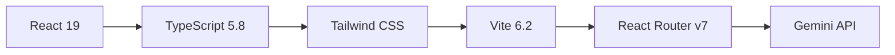
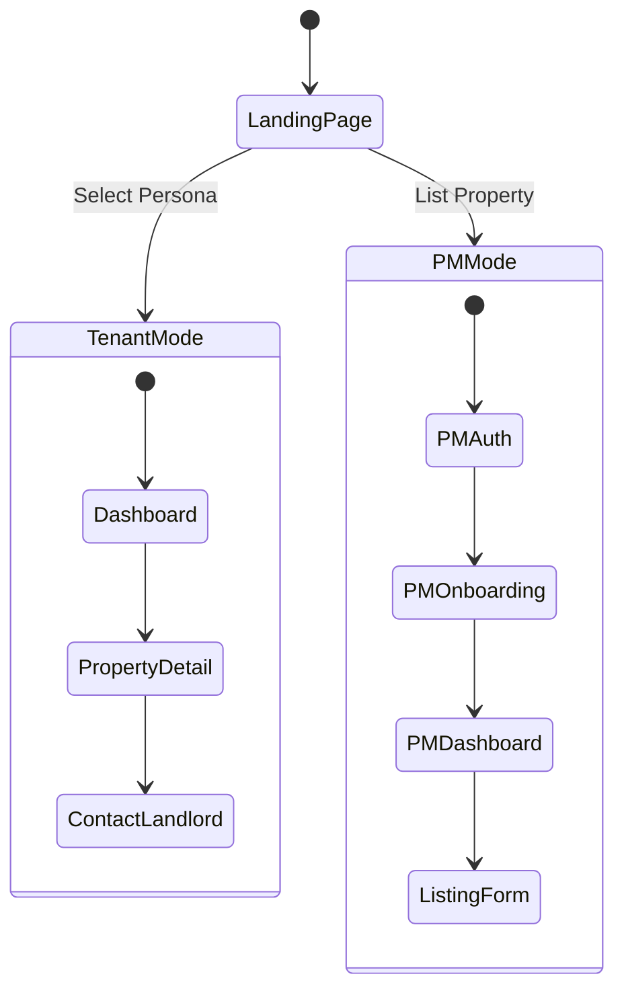

# Core Application Architecture

## Overview
NgamStay - Malaysian rental marketplace SPA with dual-mode architecture (Tenant + Property Manager flows).

## Files
- `App.tsx` - Main router, state management, PM CRUD operations
- `types.ts` - TypeScript interfaces (Listing, PMUser, UserPersona, etc.)
- `constants.tsx` - Sample data (3 personas, 12 properties)
- `index.tsx` - React 19 entry point
- `index.html` - HTML shell, Tailwind CDN
- `vite.config.ts` - Build config, Gemini API key injection
- `package.json` - Dependencies (React 19, Router v7, Gemini SDK)

## Technology Stack


**Key Libraries:**
- React 19.2.4 - UI framework
- React Router DOM 7.13.0 - HashRouter for SPA
- @google/genai 1.38.0 - AI insights
- Vite 6.2.0 - Build tool

## Dual-Mode Architecture


## State Management (App.tsx)
**Tenant State:**
```typescript
activePersona: UserPersona | null  // Selected persona filter
selectedProperty: Listing | null   // Property detail modal
```

**PM State:**
```typescript
pmMode: boolean                    // Toggle PM vs Tenant
pmUser: PMUser | null             // Current PM user
pmListings: Listing[]             // All PM listings
showOnboarding: boolean           // First-time flow
showListingForm: boolean          // Add/edit modal
editingListing: Listing | null    // Editing state
```

## Key Operations
**PM CRUD:**
- `handlePMAuthSuccess()` - Sets user, triggers onboarding if new
- `handleSaveListing()` - Adds/updates listing, auto-assigns status (PUBLISHED if verified, PENDING_REVIEW if public)
- `handleToggleAvailability()` - Toggles listing availability
- `handleEditListing()` - Opens form with existing data

**Stats Calculation:**
```typescript
const stats = useMemo(() => {
  const total = pmListings.length;
  const published = pmListings.filter(l => l.status === 'PUBLISHED').length;
  const pending = pmListings.filter(l => l.status === 'PENDING_REVIEW').length;
  const draft = pmListings.filter(l => l.status === 'DRAFT').length;
  return { total, published, pending, draft };
}, [pmListings]);
```

## Routing Strategy
- **Type:** Hash-based routing (`HashRouter`)
- **Rationale:** Client-only SPA compatibility
- **Implementation:** State-driven conditional rendering in App.tsx
- **No route definitions** - All routing via component state

## Type System (types.ts)
**Core Types:**
- `Listing` - Property with 22 fields (id, title, location, price, images, amenities, status)
- `PMUser` - Property Manager (id, name, email, phone, accountType, isVerified)
- `UserPersona` - Tenant persona (Professional, Nomad, Student)
- `ListingStatus` - DRAFT | PENDING_REVIEW | PUBLISHED | REJECTED | OCCUPIED

**Enums:**
```typescript
enum PropertyType { apartment, condo, house, studio, room }
enum AccountType { autorentic, public }
```

## Configuration
**Vite Config:**
- Define `__GEMINI_API_KEY__` from env
- Path alias: `@/` → `./src`
- React Fast Refresh enabled

**Environment:**
```bash
GEMINI_API_KEY=your_api_key_here
```

## Build Commands
```bash
npm run dev      # Dev server (port 3000)
npm run build    # Production build
npm run preview  # Preview build
```

## Lessons Learned
1. **Lifted State Pattern** - Simple for MVP, avoids Redux complexity
2. **Hash Routing** - Essential for client-only SPAs without server routing
3. **Type Safety** - TypeScript catches bugs early (e.g., status enums prevent typos)
4. **useMemo for Stats** - Prevents unnecessary recalculations
5. **Dual Mode Toggle** - Single app serves both user types efficiently

## Conclusions
- **Architecture:** Monolithic SPA works well for MVP, future can split into micro-frontends
- **State Management:** Lifted state sufficient up to ~20 components, then consider Context API
- **Bundle Size:** Minimal dependencies (only Router + Gemini SDK), fast load times
- **Scalability:** Current pattern scales to ~50 listings, needs pagination beyond that
