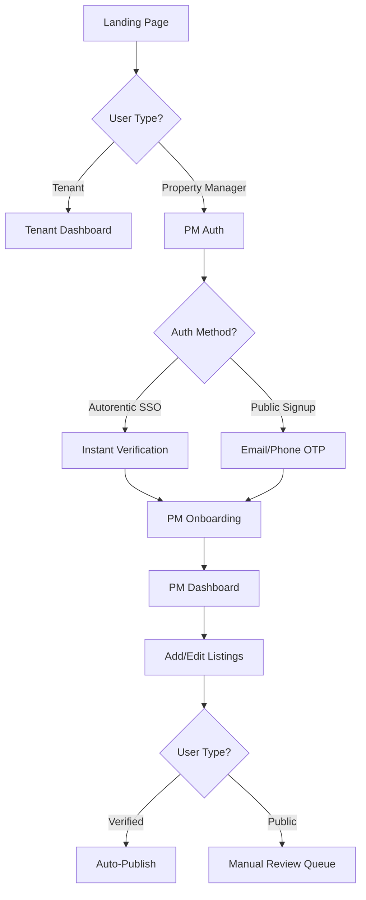
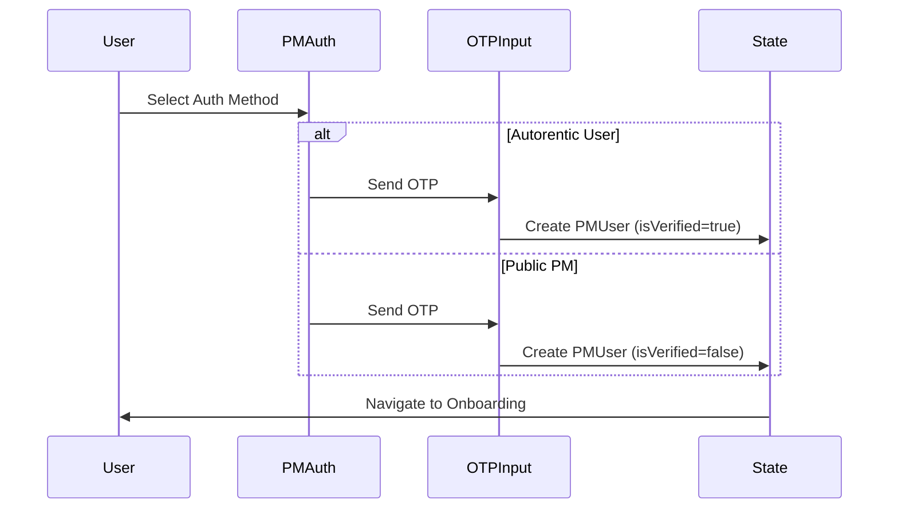
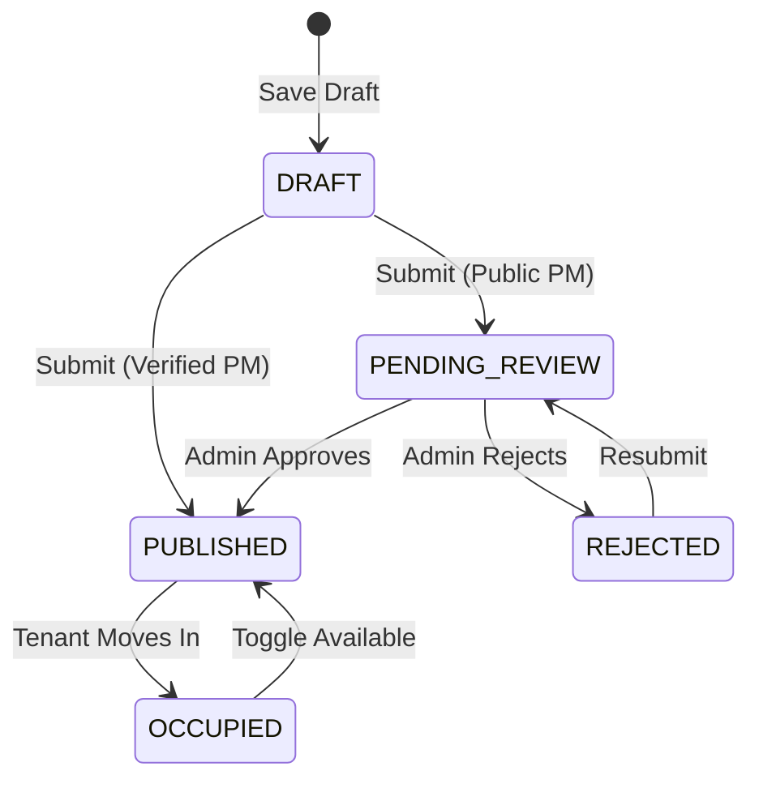
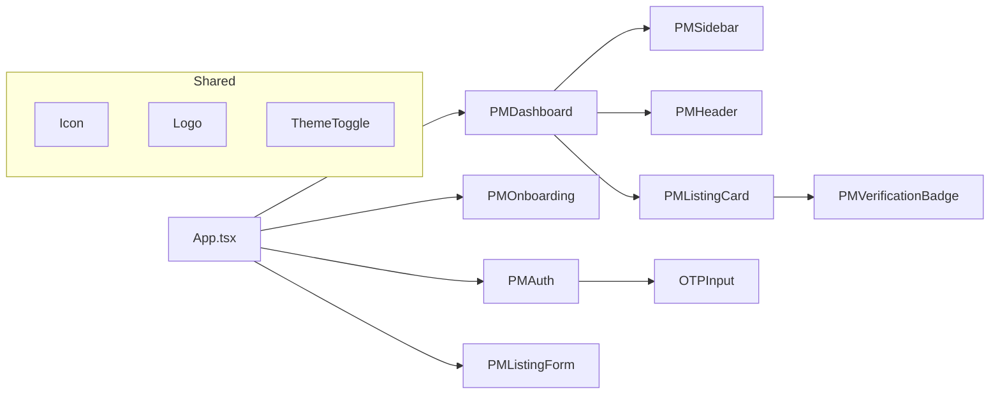

# Property Manager Flow - Implementation Summary

## Project Context
**Platform**: NgamStay - Malaysian Rental Marketplace
**Goal**: Dual-path PM onboarding (Autorentic verified + Public PMs) with trust-building mechanisms
**Strategy Source**: `README.md` - Comprehensive marketplace strategy document

## Architecture Overview



## File Structure

### Core Types (`types.ts`)
```typescript
// Added PM-specific types
- PMUser (accountType, isVerified, autorenticUserId)
- Listing extends Property (status, pmUserId, reviewNotes)
- AuthMethod enum (AUTORENTIC, EMAIL_OTP, PHONE_OTP)
- ListingStatus enum (DRAFT, PENDING_REVIEW, APPROVED, PUBLISHED, OCCUPIED, REJECTED)
- PMAccountType enum (AUTORENTIC, PUBLIC)
```

### Components Created

**Authentication & Onboarding**
- `PMAuth.tsx` - Dual auth landing, OTP verification, account creation
- `OTPInput.tsx` - 6-digit OTP input with paste support
- `PMOnboarding.tsx` - 2-step onboarding (benefits → terms)

**Dashboard & Navigation**
- `PMDashboard.tsx` - Main dashboard with stats, listings grid, tabs
- `PMSidebar.tsx` - Navigation, user profile, stats display
- `PMHeader.tsx` - Top bar with quick actions, notifications

**Listing Management**
- `PMListingForm.tsx` - 3-step form (basic → pricing → photos)
- `PMListingCard.tsx` - Listing card with status, edit, availability toggle
- `PMVerificationBadge.tsx` - Dynamic status badges

**Utilities**
- `Icon.tsx` - Centralized SVG icon component (30+ icons)

### App Integration (`App.tsx`)
- Dual mode state management (tenant vs PM flow)
- Complete CRUD for listings
- Auto-update user stats on listing changes
- "List Your Property" CTA on landing page

## Key Features Implemented

### 1. Dual Authentication Path


**Trust Differentiation**:
- Autorentic: Instant verification badge, auto-publish
- Public: Manual review (first 3 listings), progressive trust

### 2. Listing Status Flow


### 3. Form Validation & UX
**3-Step Listing Form**:
1. Basic Info (title, location, type, beds/baths/sqft)
2. Pricing & Terms (rent, promo price, utilities, amenities, tags)
3. Photos (upload, reorder, delete)

**Progressive Disclosure**: Can save draft at any step

### 4. Availability Management
- Toggle on/off for PUBLISHED listings
- Visual overlay when unavailable
- Separate from OCCUPIED status (auto-managed)

## Technical Decisions & Lessons Learned

### ❌ Problem: Lucide Icons Not Installed
**Error**: `Failed to resolve import "lucide-react"`

**Solution**: Created centralized `Icon.tsx` component
- 30+ inline SVG icons
- Zero dependencies
- Matches existing `NavIcon.tsx` pattern
- Smaller bundle size

**Lesson**: Always check existing patterns before adding dependencies

### ✅ Icon Component Pattern
```typescript
// Reusable pattern for extensibility
type IconType = 'building' | 'shield' | 'mail' | ...;
<Icon type="shield" className="w-6 h-6 text-brand-light" />
```

**Benefits**:
- Type-safe icon selection
- Consistent sizing/coloring
- Easy to extend
- Tree-shakeable

### 🎨 Design System Consistency
**Colors Used**:
- `brand-dark: #0F4C5C` - Primary CTAs, headers
- `brand-mid: #165A72` - Hover states
- `brand-light: #2BC0E4` - Accents, active states
- `brand-bg: #F7FAFC` - Page backgrounds

**Typography**: Plus Jakarta Sans (already configured)

**Patterns**:
- `rounded-3xl` for cards
- `rounded-xl` for buttons/inputs
- `dark:` variants for all colors
- `hover:-translate-y-2` for card lifts

### 📊 State Management Approach
**Lifting State Up**:
- PM mode state in `App.tsx`
- Props drilling for data flow
- Simple, no external state library needed

**User Stats Auto-Update**:
```typescript
// Recalculate on every listing change
updatedUser.listingCount = listings.length;
updatedUser.approvedListingCount = listings.filter(
  l => l.status === PUBLISHED || l.status === APPROVED
).length;
```

### 🔐 Trust Mechanisms Implemented
1. **Verification Badges**: Visual trust indicators per listing
2. **Manual Review Queue**: First 3 listings for public PMs
3. **Status Transparency**: Clear pending/rejected states
4. **Review Feedback**: Show rejection reasons
5. **Availability Toggle**: Prevent ghost listings

## Component Relationships



## Data Flow

### Listing Creation Flow
1. User clicks "Add New Listing"
2. `PMDashboard` calls `onAddListing()`
3. `App.tsx` sets `showListingForm = true`
4. `PMListingForm` renders with 3-step wizard
5. User fills form, clicks "Publish" or "Save Draft"
6. `PMListingForm` calls `onSave(listingData, isDraft)`
7. `App.tsx` updates `pmListings` state
8. `App.tsx` recalculates `pmUser` stats
9. Form closes, dashboard refreshes

### Availability Toggle Flow
1. User clicks toggle on `PMListingCard`
2. Card calls `onToggleAvailability(listingId)`
3. `PMDashboard` passes to `App.tsx`
4. `App.tsx` maps listings, flips `isAvailable`
5. UI updates instantly (optimistic update)

## Performance Considerations

### Bundle Size Optimizations
- Inline SVG icons (no lucide-react dependency)
- No external form libraries (native inputs)
- Conditional rendering (only load active view)
- Image placeholders (using picsum.photos)

### React Optimizations
- `useMemo` for filtered properties (tenant flow)
- Functional state updates (avoid stale closures)
- Lifted state (minimal re-renders)

## Testing Scenarios

### Autorentic PM Flow (Verified)
1. Click "List Your Property" → "Autorentic User"
2. Enter any email/phone → any 6-digit OTP
3. See onboarding with "Auto-verified" messaging
4. Accept terms → Dashboard
5. Add listing → 3-step form → Submit
6. **Result**: Status = PUBLISHED, Badge = "Verified Listing"

### Public PM Flow (Unverified)
1. Click "List Your Property" → "New Property Manager"
2. Enter name + email/phone → any 6-digit OTP
3. See onboarding with manual review messaging
4. Accept terms → Dashboard
5. Add listing → 3-step form → Submit
6. **Result**: Status = PENDING_REVIEW, Badge = "Under Review"
7. **Note**: Shows 24-48hr review notice

### Availability Management
1. Create & publish listing
2. Toggle availability OFF
3. **Result**: Visual overlay "Marked Unavailable"
4. Toggle back ON
5. **Result**: Normal display, available to tenants

## Conclusions & Next Steps

### ✅ Achievements
- Complete PM flow from landing → conversion
- Dual authentication paths working
- Trust differentiation (verified vs public)
- Responsive design (mobile + desktop)
- Dark mode support throughout
- Zero icon dependency issues

### 🚀 Recommended Enhancements
1. **Lead Management**: Inbox for tenant inquiries
2. **Analytics Dashboard**: Views, inquiries, conversion rates
3. **Bulk Operations**: Multi-select, batch publish/unpublish
4. **Photo Upload**: Real file upload (currently placeholders)
5. **Autorentic Integration**: Actual API sync (currently simulated)
6. **Search/Filter**: PM dashboard listing filters
7. **Pagination**: For PMs with many listings
8. **Notifications**: Email/WhatsApp alerts for inquiries

### 📝 README Strategy Alignment
| Strategy Item | Implementation Status |
|--------------|----------------------|
| Dual auth paths | ✅ Complete |
| Trust badges | ✅ Complete |
| Manual review queue | ✅ Simulated (UI ready) |
| Progressive trust | ✅ Logic implemented |
| Standalone viability | ✅ Public PMs fully functional |
| Hybrid management | ⏳ MVP (full sync needs backend) |
| Single-system illusion | ✅ Embedded in tenant landing |

### 🎯 Production Readiness Checklist
- [ ] Replace OTP simulation with real SMS/email service
- [ ] Implement actual file upload for photos
- [ ] Add form validation error messages
- [ ] Connect to backend API (listings CRUD)
- [ ] Implement admin review dashboard
- [ ] Add rate limiting on listing creation
- [ ] Duplicate detection (address + images)
- [ ] User session persistence (localStorage/cookies)
- [ ] Error boundary components
- [ ] Loading states for async operations

## Token-Efficient Reference

**Quick Command Reference**:
```bash
# Dev server
npm run dev

# Test PM flow
1. Click "List Your Property"
2. Choose auth path (Autorentic vs Public)
3. Enter dummy data + any 6-digit OTP
4. Complete onboarding
5. Add listing via 3-step form
```

**Key File Paths**:
```
types.ts                          # PM types
components/
  ├── Icon.tsx                    # SVG icon system
  ├── PMAuth.tsx                  # Auth landing + login
  ├── PMOnboarding.tsx            # 2-step onboarding
  ├── PMDashboard.tsx             # Main PM interface
  ├── PMListingForm.tsx           # 3-step listing wizard
  └── PM*.tsx                     # Other PM components
App.tsx                           # Dual mode routing
README.md                         # Strategy document
```

**Color Palette**:
- Dark: `#0F4C5C` | Mid: `#165A72` | Light: `#2BC0E4` | BG: `#F7FAFC`

**Status Colors**:
- Draft: Gray | Pending: Yellow | Published: Blue | Verified: Green | Rejected: Red

---

**Last Updated**: 2026-01-29
**Implementation Time**: ~2 hours
**Files Created**: 9 components + 1 utility + updated App.tsx
**Lines of Code**: ~2500 LOC
**Dependencies Added**: 0 (zero!)
