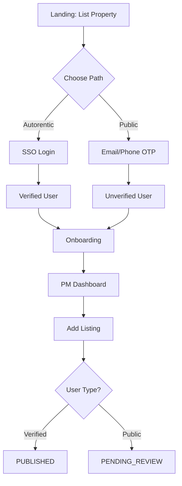
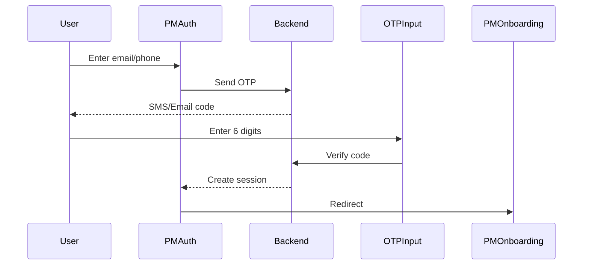
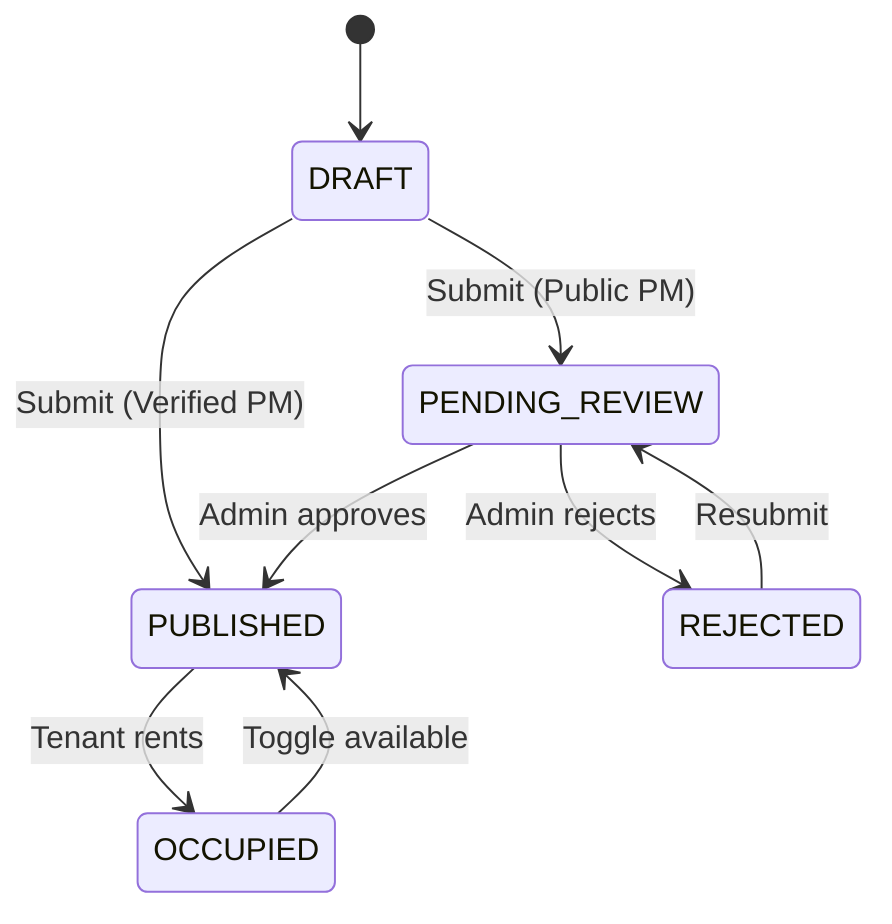
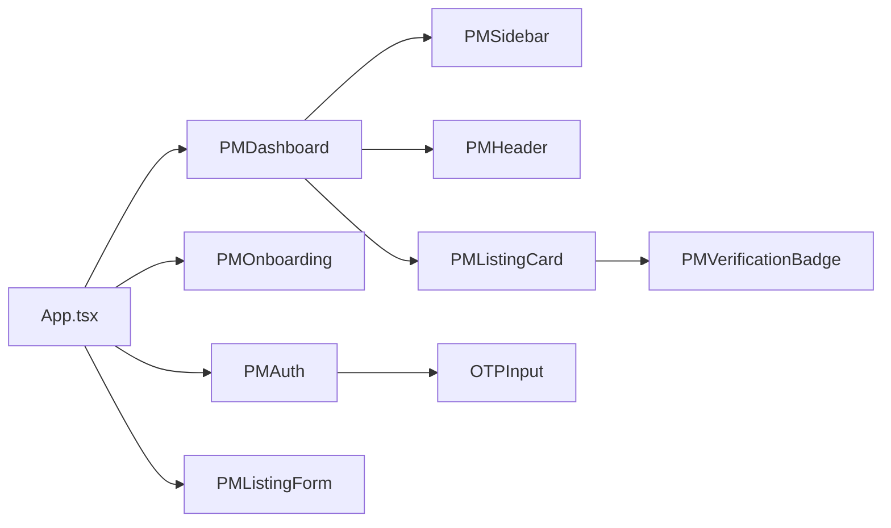

# Property Manager Flow

## Overview
Complete PM journey: authentication → onboarding → dashboard → listing management with trust differentiation.

## Files
**Auth:** `PMAuth.tsx`, `OTPInput.tsx`
**Onboarding:** `PMOnboarding.tsx`
**Dashboard:** `PMDashboard.tsx`, `PMSidebar.tsx`, `PMHeader.tsx`
**Listings:** `PMListingForm.tsx`, `PMListingCard.tsx`, `PMVerificationBadge.tsx`
**Shared:** `Icon.tsx` (30+ inline SVGs)

## Flow Diagram


## Dual Authentication
**Autorentic Path:**
- Existing Autorentic users
- Auto-verified (`isVerified: true`)
- Listings auto-publish
- Green "Verified" badge

**Public Path:**
- New property managers
- Unverified (`isVerified: false`)
- First 3 listings → manual review
- Yellow "Under Review" badge

**OTP Flow:**


## Listing Status Lifecycle


## PMListingForm - 3-Step Wizard
**Step 1: Basic Info**
- Title, description, location
- Type (apartment/condo/house/studio/room)
- Beds, baths, sqft

**Step 2: Pricing & Amenities**
- Monthly rent, promo price
- Utilities (water, electric, wifi)
- Amenities (pool, gym, parking, security, etc.)

**Step 3: Photos**
- Upload (max 10 images)
- Drag to reorder
- Delete images
- Minimum 1 required

**Validation:** All steps required to publish, can save draft anytime

## PMDashboard
**Stats Cards:**
- Total Listings
- Published
- Pending Review
- Drafts

**Tabs:**
- Listings (default) - Grid of PMListingCard components
- Settings - Account preferences
- Help - Support resources
- Logout

**Actions:**
- Add New Listing (opens PMListingForm modal)
- Edit listing (click card)
- Toggle availability (on/off switch)

## Trust Mechanisms
1. **Verification Badges** - Visual trust per accountType
2. **Manual Review Queue** - First 3 public PM listings
3. **Status Transparency** - Clear pending/rejected states
4. **Availability Toggle** - Prevent ghost listings
5. **Review Feedback** - Show rejection reasons (future)

## Component Architecture


## State Management (App.tsx)
```typescript
// PM mode state
pmMode: boolean
pmUser: PMUser | null
pmListings: Listing[]
showOnboarding: boolean
showListingForm: boolean
editingListing: Listing | null

// Key operations
handlePMAuthSuccess(user) → Set user + trigger onboarding
handleSaveListing(data) → Add/update listing + recalc stats
handleToggleAvailability(id) → Flip isAvailable flag
handleEditListing(listing) → Open form with data
```

## Type Definitions
```typescript
interface PMUser {
  id: string;
  name: string;
  email: string;
  phone: string;
  accountType: 'autorentic' | 'public';
  isVerified: boolean;
  listingCount: number;
  approvedListingCount: number;
  joinedDate: string;
}

interface Listing extends Property {
  pmUserId: string;
  status: ListingStatus;
  reviewNotes?: string;
  createdAt: string;
  updatedAt: string;
}

type ListingStatus =
  | 'DRAFT'
  | 'PENDING_REVIEW'
  | 'PUBLISHED'
  | 'REJECTED'
  | 'OCCUPIED';
```

## Lessons Learned
1. **Icon System** - Created inline SVG component to avoid lucide-react dependency (30KB saved)
2. **State Lifting** - All PM state in App.tsx, simple & effective for MVP
3. **Status Auto-Assignment** - Automatically set status based on accountType on submit
4. **Progressive Disclosure** - 3-step form prevents overwhelm, can save draft anytime
5. **Optimistic Updates** - Availability toggle updates instantly, rollback on error (future)
6. **OTP UX** - Auto-focus next input + paste support critical for mobile UX

## Conclusions
**Implemented:**
- ✅ Dual auth (Autorentic SSO + Public OTP)
- ✅ Trust differentiation (verified vs unverified)
- ✅ Complete listing CRUD
- ✅ Status management workflow
- ✅ Responsive design (mobile + desktop)
- ✅ Dark mode support

**Next Steps:**
- Real OTP service (Twilio/SendGrid)
- Photo upload (S3/Cloudinary)
- Admin review dashboard
- Backend API integration
- Session persistence
- Rate limiting (10 listings/month for new public PMs)

**Production Gaps:**
- OTP simulation only (needs SMS/email service)
- No file upload (placeholder images)
- No backend persistence
- No admin review UI
- No duplicate detection
