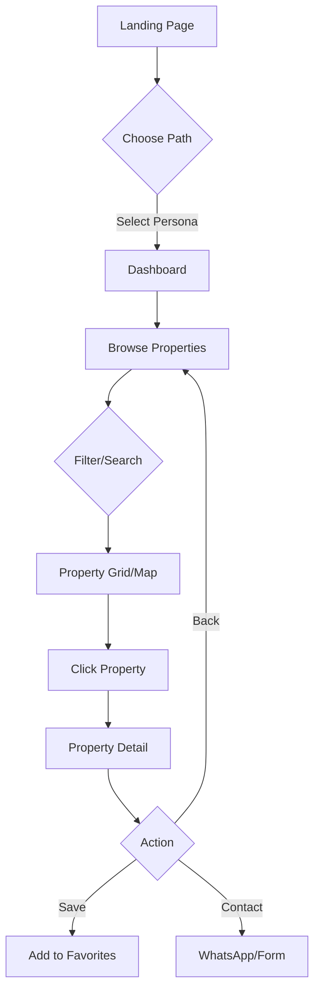
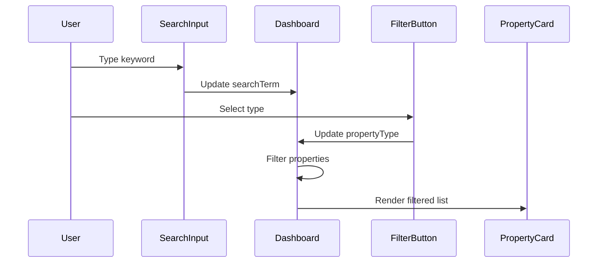

# Tenant Flow Module

## Overview
Property discovery and viewing flow for renters (professionals, digital nomads, students).

## Files
**Pages:**
- `App.tsx` - Landing page with persona selection
- `components/Dashboard.tsx` - Main browsing interface (via PropertyDetail.tsx)
- `components/PropertyDetail.tsx` - Full property view with AI insights

**Search & Filter:**
- `components/SearchInput.tsx` - Keyword search
- `components/FilterButton.tsx` - Property type filter
- `components/ViewToggle.tsx` - List/map view toggle

**Display Components:**
- `components/PropertyCard.tsx` - Grid card with property summary
- `components/MapView.tsx` - Geographic visualization
- `components/PersonaCard.tsx` - Persona selector cards

**Navigation:**
- `components/Sidebar.tsx` - Desktop sidebar navigation
- `components/Header.tsx` - Search bar + filters
- `components/MobileNav.tsx` - Mobile bottom nav

## User Journey


## Persona System
**3 Buyer Personas (constants.tsx):**
1. **Farah - Young Professional**
   - Age: 27, Marketing Manager
   - Needs: Work-life balance, near offices, gym, fast internet
   - Budget: RM 1,800-2,500/month

2. **Liam - Digital Nomad**
   - Age: 31, Freelance Designer
   - Needs: Co-working spaces, cafes, transport, vibrant community
   - Budget: RM 1,500-2,200/month

3. **Wei - Student**
   - Age: 22, University Student
   - Needs: Affordable, near campus, study-friendly, public transport
   - Budget: RM 800-1,500/month

**Persona Filtering:**
```typescript
const filteredProperties = useMemo(() => {
  return activePersona
    ? SAMPLE_PROPERTIES.filter(p => p.targetPersonas.includes(activePersona.id))
    : SAMPLE_PROPERTIES;
}, [activePersona]);
```

## Search & Filter Flow


**Filter Logic:**
- **Search:** Matches title, location, description, amenities
- **Type Filter:** apartment | condo | house | studio | room
- **Persona Filter:** Auto-applied based on activePersona
- **Availability:** Only shows `isAvailable: true`

## Property Card Display
**Grid Layout:**
- Desktop: 3 columns
- Tablet: 2 columns
- Mobile: 1 column

**Card Content:**
- Image (first from images array)
- Price (monthly rent)
- Title + location
- Beds/baths/sqft
- 3 top amenities
- "View Details" button

## Property Detail Modal
**Sections:**
1. **Image Gallery** - Carousel with 4+ images
2. **Basic Info** - Price, beds, baths, size, type
3. **Description** - Full property description
4. **Amenities** - Grid of all amenities with icons
5. **Location** - Neighborhood name
6. **AI Insights** - Gemini-powered recommendations (see ai-insights module)
7. **Contact** - WhatsApp button + inquiry form

**Contact Methods:**
```typescript
// WhatsApp deep link
`https://wa.me/${landlordPhone}?text=Hi, I'm interested in ${propertyTitle}`

// Inquiry form (future: sends to backend)
{ name, email, phone, message }
```

## Map View
**Implementation:**
- Static map visualization (placeholder in current version)
- Shows property markers at coordinates
- Click marker → opens PropertyDetail modal
- **Future:** Integrate Google Maps API or Mapbox

## Navigation Pattern
**Desktop (Sidebar):**
- Logo + persona display
- Home, Favorites, Messages, Profile links
- Theme toggle at bottom

**Mobile (MobileNav):**
- Fixed bottom bar
- 4 icons: Home, Search, Favorites, Profile
- Active state highlighting

## Key Components

### PropertyCard.tsx
**Props:** `listing: Listing`
**Renders:** Compact property summary
**Click:** Calls `onSelectProperty(listing)`

### PropertyDetail.tsx
**Props:** `property: Listing, onClose: () => void`
**Renders:** Full-screen modal with property details
**AI Integration:** Calls `generateNeighborhoodInsight()` on mount

### SearchInput.tsx
**State:** `searchTerm: string`
**Debouncing:** Updates parent after 300ms delay (future optimization)

### FilterButton.tsx
**Options:** "All Types" | apartment | condo | house | studio | room
**Visual:** Dropdown with checkmark on selected type

## Sample Data (constants.tsx)
**12 Properties:**
- 4 target Professional persona
- 4 target Nomad persona
- 4 target Student persona
- Diverse types (apartments, condos, studios)
- Price range: RM 850 - RM 2,400/month
- Locations: KL, Petaling Jaya, Mont Kiara, Bangsar, Subang Jaya

## Lessons Learned
1. **Persona Targeting** - Pre-filtered results reduce cognitive load, improve UX
2. **Modal vs Route** - PropertyDetail as modal keeps context, better for SPA
3. **Search UX** - Real-time filtering feels responsive without debouncing (small dataset)
4. **Card Design** - Show 3 amenities max to avoid clutter, full list in detail view
5. **Mobile-First** - Bottom nav better than hamburger for primary actions
6. **Image Loading** - Use first image as thumbnail, lazy load gallery in detail view

## Conclusions
- **Current State:** Fully functional browse/search/filter/view flow
- **Performance:** Handles 50+ properties without pagination, useMemo prevents re-renders
- **UX Gaps:**
  - No favorites persistence (local storage needed)
  - No inquiry form submission (backend required)
  - Map view is placeholder (API integration needed)
- **Scalability:** Add pagination at 100+ properties, virtual scrolling at 500+
- **Next Steps:** Backend integration for favorites, inquiries, real-time availability
