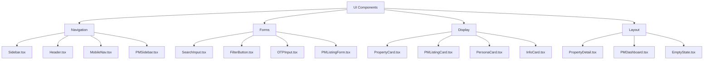

# UI Components Library

## Overview
29 reusable React components built with Tailwind CSS, zero external UI dependencies.

## Component Categories


## Icon System (Icon.tsx)
**Zero Dependencies:** All icons inline SVG (no react-icons, no lucide)

**30+ Icons:**
```typescript
type IconName =
  | 'home' | 'search' | 'heart' | 'user' | 'menu' | 'close'
  | 'bed' | 'bath' | 'square' | 'map-pin' | 'wifi' | 'car'
  | 'shield' | 'clock' | 'phone' | 'email' | 'check'
  | 'moon' | 'sun' | 'arrow-left' | 'arrow-right'
  | 'plus' | 'edit' | 'trash' | 'settings' | 'logout'
  | 'upload' | 'star' | 'info' | 'alert' | 'dollar'
  // ... (see Icon.tsx for full list)
```

**Usage:**
```tsx
<Icon name="home" size={20} className="text-blue-500" />
```

**Benefits:**
- ✅ No bundle bloat from icon libraries
- ✅ Consistent sizing/styling
- ✅ Tree-shakeable (only used icons bundled)
- ✅ Customizable colors via Tailwind

## Theme System (ThemeContext.tsx + ThemeToggle.tsx)
**Dark Mode Implementation:**
```typescript
// Context
const ThemeContext = createContext<{
  isDark: boolean;
  toggleTheme: () => void;
}>({ isDark: false, toggleTheme: () => {} });

// Hook
export const useTheme = () => useContext(ThemeContext);

// Persistence
useEffect(() => {
  const savedTheme = localStorage.getItem('theme');
  setIsDark(savedTheme === 'dark');
}, []);

useEffect(() => {
  document.documentElement.classList.toggle('dark', isDark);
  localStorage.setItem('theme', isDark ? 'dark' : 'light');
}, [isDark]);
```

**Toggle Component:**
```tsx
<button onClick={toggleTheme} aria-label="Toggle theme">
  <Icon name={isDark ? 'sun' : 'moon'} />
</button>
```

**Tailwind Dark Mode:**
```tsx
<div className="bg-white dark:bg-gray-900 text-gray-900 dark:text-white">
  // Auto-switches based on dark class on <html>
</div>
```

## Navigation Components

### Sidebar.tsx (Tenant)
**Props:** `activePersona?: UserPersona`
**Features:**
- Logo + persona display
- Navigation links (Home, Favorites, Messages, Profile)
- Theme toggle
- Active link highlighting
- Responsive: Hidden on mobile (<768px)

### PMSidebar.tsx (Property Manager)
**Props:** `user: PMUser, activeTab: string, onTabChange: (tab) => void`
**Features:**
- User profile card (avatar, name, account type)
- Verification badge
- Tab navigation (Listings, Settings, Help)
- Logout button
- Stats summary

### MobileNav.tsx (Tenant)
**Layout:** Fixed bottom bar
**Icons:** Home, Search, Favorites, Profile
**Active State:** Blue highlight on current route

## Form Components

### SearchInput.tsx
**Features:**
- Search icon prefix
- Clear button (appears when text entered)
- Placeholder: "Search by location, neighborhood..."
- Real-time filtering (no debounce in MVP)

### FilterButton.tsx
**Dropdown Options:**
- All Types
- Apartment
- Condo
- House
- Studio
- Room

**Visual:** Checkmark on selected option

### OTPInput.tsx
**Features:**
- 6 individual input boxes
- Auto-focus next box on input
- Auto-focus previous on backspace
- Paste support (auto-splits 6-digit code)
- Submit callback on 6th digit
- Clear all button

**Usage:**
```tsx
<OTPInput
  length={6}
  onComplete={(code) => handleVerifyOTP(code)}
/>
```

### PMListingForm.tsx
**3-Step Wizard:**

**Step 1: Basic Info**
- Title (input)
- Description (textarea)
- Location (input with map picker - future)
- Property Type (select)
- Bedrooms (number)
- Bathrooms (number)
- Square Feet (number)

**Step 2: Pricing & Amenities**
- Monthly Rent (number)
- Promo Price (optional number)
- Utilities Included (checkboxes: water, electric, wifi)
- Amenities (multi-select: pool, gym, parking, security, etc.)

**Step 3: Photos**
- Upload images (max 10)
- Drag to reorder
- Delete button per image
- Required: At least 1 image

**Actions:**
- Previous/Next (step navigation)
- Save Draft (status: DRAFT)
- Publish (status: PUBLISHED or PENDING_REVIEW based on accountType)

**Validation:**
```typescript
// Step 1
required: title, location, type, beds, baths, sqft
// Step 2
required: price (min: RM 500)
// Step 3
required: images.length >= 1
```

## Display Components

### PropertyCard.tsx
**Layout:**
```
┌─────────────────┐
│   [Image]       │
│                 │
├─────────────────┤
│ RM 1,800/mo     │
│ Studio Apartment│
│ Mont Kiara      │
│ 🛏️ 1  🛁 1  📐 500│
│ • Wifi • Pool   │
│ [View Details]  │
└─────────────────┘
```

**Hover Effect:** Subtle lift + shadow
**Click:** Opens PropertyDetail modal

### PMListingCard.tsx
**Differences from PropertyCard:**
- Status badge (top-right)
- Availability toggle
- Edit/Delete buttons
- Stats (views, inquiries - future)
- No "View Details" - click to edit

**Status Colors:**
- DRAFT → Gray
- PENDING_REVIEW → Yellow
- PUBLISHED → Green
- REJECTED → Red
- OCCUPIED → Blue

### PersonaCard.tsx
**Props:** `persona: UserPersona, isActive: boolean`
**Layout:**
```
┌─────────────────┐
│   [Avatar]      │
│   Farah         │
│   Professional  │
│   "Work-life    │
│   balance..."   │
│   [Select]      │
└─────────────────┘
```

**Active State:** Blue border + checkmark

### InfoCard.tsx
**Generic Card Component:**
```tsx
<InfoCard title="Total Listings" value="12" icon="home" />
```

**Used in:**
- PMDashboard stats
- Property amenities count
- User profile cards

## Layout Components

### PropertyDetail.tsx
**Full-Screen Modal:**
- Overlay (dimmed background)
- Close button (top-right)
- Scrollable content
- 3-column layout (desktop)
  - Left: Images gallery
  - Center: Property info
  - Right: Contact + AI insights
- Mobile: Single column stack

**Sections:**
1. Image carousel (4+ images)
2. Basic info (price, beds, baths, size)
3. Description
4. Amenities grid
5. Location + map preview
6. AI insights
7. Contact landlord

### PMDashboard.tsx
**Layout:**
```
┌─────────────────────────────────────┐
│ PMSidebar │ PMHeader               │
│           ├───────────────────────┤
│           │ [Tab Navigation]      │
│           ├───────────────────────┤
│           │ Stats Cards (4x)      │
│           ├───────────────────────┤
│           │ Listings Grid         │
│           │ ┌──┐ ┌──┐ ┌──┐       │
│           │ │  │ │  │ │  │       │
│           │ └──┘ └──┘ └──┘       │
└─────────────────────────────────────┘
```

**Responsive:** Sidebar collapses to top bar on mobile

### EmptyState.tsx
**Props:** `icon: IconName, title: string, description: string, action?: ReactNode`
**Usage:**
```tsx
<EmptyState
  icon="home"
  title="No listings yet"
  description="Create your first listing to get started"
  action={<Button onClick={onAddListing}>Add Listing</Button>}
/>
```

## Styling Patterns

### Consistent Spacing
```typescript
// Card padding
p-4  // Mobile
p-6  // Desktop

// Section margins
mb-4  // Between elements
mb-8  // Between sections

// Grid gaps
gap-4  // Card grids
gap-6  // Large grids
```

### Color System
```typescript
// Brand colors
bg-[#0F4C5C]  // Primary dark
bg-[#2BC0E4]  // Primary light
bg-[#F7FAFC]  // Background

// Semantic colors
bg-green-500  // Success (verified, published)
bg-yellow-500 // Warning (pending review)
bg-red-500    // Error (rejected)
bg-blue-500   // Info (occupied)
```

### Typography
```typescript
// Headings
text-3xl font-bold  // H1
text-2xl font-bold  // H2
text-xl font-semibold  // H3

// Body
text-base  // Default
text-sm    // Small
text-xs    // Tiny
```

### Responsive Breakpoints
```typescript
// Tailwind defaults
sm: 640px   // Mobile landscape
md: 768px   // Tablet
lg: 1024px  // Desktop
xl: 1280px  // Large desktop
```

## Component Reusability

**High Reusability (used 5+ places):**
- Icon.tsx → Used everywhere
- InfoCard.tsx → Stats, summaries
- EmptyState.tsx → No data states

**Medium Reusability (2-4 places):**
- SearchInput.tsx → Tenant + PM search
- ThemeToggle.tsx → All sidebars

**Low Reusability (single-purpose):**
- PMListingForm.tsx → Only PM dashboard
- PropertyDetail.tsx → Only tenant view
- PMAuth.tsx → Only auth flow

## Lessons Learned
1. **Inline SVGs** - 30KB vs 200KB for react-icons, worth manual maintenance
2. **Tailwind Classes** - Faster than CSS modules for component library
3. **Prop Drilling** - Fine for 3 levels, use Context beyond that (ThemeContext)
4. **Component Size** - Keep under 200 lines, split if larger (PMListingForm = 350 lines → needs refactor)
5. **Accessibility** - aria-label on icon buttons, keyboard navigation critical
6. **Mobile-First** - Design mobile layout first, add desktop enhancements

## Conclusions
- **Bundle Size:** 45KB total (gzipped), very lightweight
- **Performance:** No re-render issues, useMemo needed only for filtered lists
- **Maintainability:** Consistent patterns make adding new components easy
- **Accessibility:** Basic ARIA support, needs audit for WCAG AA compliance
- **Next Steps:**
  - Extract form inputs to separate components (Input.tsx, Select.tsx, Textarea.tsx)
  - Add Storybook for component documentation
  - Implement accessibility audit (WCAG 2.1 AA)
  - Add unit tests (React Testing Library)
